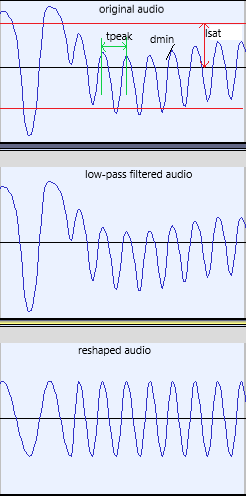

# AtomTapeUtils
This is a set of utilities mainly targeting decoding and encoding of Acorn Atom & BBC Micro BASIC programs. Some utilites (like filtering of tape files) could be useful also for other applications.

## Prerequisites
You need to have cmake and zlib installed on your computer before trying to install AtomTapeUtils.

## Description of the utilities
All utilites are run from command line (DOS or Linux). There are many utilities and the easiest way to explain them is to decsribe a few typical usages. 

### You have a tape with old Acorn Atom/BBC Micro programs that you have digitalised into a WAV file and you want to extract the programs from it.

The WAV file must be a 16-bit/mono PCM file (preferable 44.1 kHz but other samplein rates could be used as well).
Filter the WAV file *my_tape.wav* to clean it up a bit before trying to decode it.
(This filtering can be skipped if you already have an audio file of excellent quality.)

`> FilterTape my_tape.wav -o my_filtered_tape.wav`

Then extract programs from it

`> ScanTape my_filtered_tape.wav -g my_files_dir`

The ScanTape utility can also take a CSW or an UEF file as input should you previously have converted your WAV files into CSW/UEF files.
The utility will automatically detect whether it is a UEF, WAV or CSW file. Default is to detect Acorn Atom program data. For detection of BBC Micro programs, use flag '-bbm'.

For each detected Acorn Atom/BBC Micro program file, the following files will be generated and stored in the directory *my_files_dir*:
- *program name*.abc - text file with the BASIC program (looks as it would appear when listed on the Acorn Atom/BBC Micro)
- *program name*.dat - hex dump of the same program file (useful if the program includes binary data)
- *program name*.uef - UEF file that can be loaded into an emulator like Atomulator (for Acorn Atom) or BeenEm (for BBC Micro)
- *program name* - TAP/MMC "ATM" ("Wouter Ras" format) file (Acorn Atom only) that can be stored on an SD memory card (or in the MMC directory of Atomulator) for use with an AtoMMC device connected to an Acorn Atom. Please note that the TAP and MMC is one and the same format. A TAP/MMC file can also be loaded into the Acorn Atom emulator from Wouter Ras

The program name will be used as the file name. Any detected non-alphanumeric characters will however be replaced with \_XX in the generated file's name where XX is the hex code for the character. If the decoded file is corrupted, then only the .abc and .dat files are generated and the file name base will be *program name*\_incomplete*\_*n1*\_*n2* where n1 and n2 tell which blocks of the program were detected (from block n1 to block n2). If a block is just partially detected, the missing data bytes will be replaced with zeroes in the generated files. Thus, it is possible to recover partially read files to some extent.

The utility ScanTAP (Acorn Atom only) is similar to ScanTape but instead takes a TAP file as input and extracts the included Atom Tape Files in the same way as ScanTape does.

### You have written a program on your desktop (myprog.abc) and want to encode it as something that can be run on an emulator or loaded into an Acorn Atom

Convert to UEF format (for loading into emulator)

`> abc2uef myprog.abc -o myprog.uef`

Convert to CSW format (for loading into emulator; you need first to generate the UEF file)

`> uef2csw myprog.uef -o myprog.csw`

Convert to TAP/MMC format (for loading into emulator or onto memory card of an AtoMMC device)

`> abc2tap myprog.abc -o myprog`

Convert to WAV format (for loading into an Acorn Atom via audio cable connected between desktop and Acorn Atom)

`> abc2wav myprog.abc -o myprog.wav`

Optionally, you could do all this (except for the WAV & CSW files generation) with just one command:

`> abc2all myprog.abc -g gen_dir`

### Other utilities

- abc2bin: Convert an Acorn Atom/BBC Micro program into a binary data (as it would be stored on the target machine)
- abc2dat: Convert an Acorn Atom/BBC Micro program text file into a hex dump file (showing how the program will be stored on an Acorn Atom)
- bin2abc: Convert a binary data file into an Acorn Atom/BBC Micro program
- csw2wav: Convert a CSW file to a WAV file (44.1kHz/16-bit/mono PCM) - this has no machine contect and can be used independently of the target machine
- dat2abc: Convert hex dump file into text file with an Acorn Atom/BBC Micro program
- dat2bin: Convert hex dump file into binary file (useful if you want to disassemble machine code)
- dat2tap: Convert hex dump file into a TAP/MMC file (Acorn Atom only)
- dat2uef: Convert hex dump file into  an UEF file
- dat2wav: Convert hex dump file into a WAV file (16-bit PCM WAV for Acorn Atom)
- tap2abc: Convert TAP/MMC file into an Acorn Atom program text file
- tap2dat: Convert TAP/MMC file into a hex dump file
- uef2csw: Convert UEF file into a CSW file - this has no machine contect and can be used independently of the target machine*
- uef2wav: Combert UEF file into WAW file (44.1kHz/16-bit/mono PCM) - this has no machine contect and can be used independently of the target machine*
- uef2dat: Convert UEF file into a hex dump file
- inspectfile: hex dump of a file content
- inspectEUF: Display information of chunks in the EUF file + hex dump of content from all data chunks - this has no machine contect and can be used independently of the target machine

\* Although the conversion from EUF to CSW/WAV is in theory machine-independent, the use of simple data chunks can cause a problem as a default data byte encoding is assumed (8N1). If you suspect there are such chunks, a target machine (-atm for Acorn Atom and -bbm for BBC Micro) could be still be specified to tell what format shall be used for such chunks.
### Utility program flags
There are many possibilities to tailor especially the tape filtering and tape scannning. Write *utility name* and press enter to get information about the command line flags you can provide to do this tailoring. One useful feature (enabled by flag '-m') is e.g. the ability to generate a WAV file that includes both the original audio and the filtered audio for manual inspection when you are experiencing difficulties with some tapes (i.e. they are not successfully decoded with ScanTape later on). This WAV file cannot be used by ScanTape though as ScanTape expects only one channel with audio data. You could also turn on logging of detected faults during decoding of a tape (flag '-t') that will tell you at what points in time the decoding fails (like preamble byte #2 read failure).
To have more verbose output (each utility as default runs in silent mode with none or very little output), the flag '-v' can be used. For detection/generation of BBC Micro programs, use flag '-bbm'.

# FilterTape
This utility filters tape audio. The filtering is made in two steps. The picture below shows how an original tape audio is filtered and reshaped.
<p align="left">
  
</p>

## Low-pass filtering
Here the samples are averaged. The number of samples to average is given by the flag '-a n'. The number of samples to average is 2n+1. Default is 1 => 3 samples.

## Reshaping of the audio based on peak detection
Here the extremums are detected based on the derivate of the audio signal and new sinusoidal waves are created based on these extremums (peaks). A derivate threshold (flag '-d level'; default is 10) specifies the the absolute minium derivate dmin (unit: amplitude step / sample) that should be considered. A low value means that the detection will be very sensitive to noise but also that very tiny signal changes will be possibly to detect. Saturation thresholds - tsat can also be specified to clip the signal when its absolute value is larger than a certain percentage of the maximum absolute value amplitude. The parameters '-sl low_level' and '-sh high_level' (default 0.8 <=> 80%) specify these thresholds. The minimum distance - tpeak - between peaks to considerer (parameter '-p dist') can be specified to avoid noise being detected as peaks (especially if the derivative threshold is set low resulting in high sensitivity to noise). Default is 0.0 (0%  of the duration of a 2400 Hz tone).

# ScanTape
This utility scans a WAW or CSW file for Atom programs. It has many parameters but the defalt values should work well for most tapes. However, if programs are not detected properly, the flag 'f tolerance' could be used to specify a higher tolerance for frequency variations. Default is 0.1 (10%) but values up to 0.4 (40%) could be tested when programs are not detected.
A hysteresis (schmittt-trigger operation) is used when detecting the transitions Low->High->Low. The flag '-l level' spefifies the percentage used here. Default is 0.1 (10%).
If programs are only partially correctly detected, errors will be reported:

```
>scantape tape.wav -g my_dir

At least one block missing or corrupted for file 'TALK' [0h:0m:0.000000s (0.000000s),0h:4m:36.441723s (276.441723s)]
At least one block missing or corrupted for file 'CONVOY' [0h:29m:4.326054s (1744.326054s),0h:30m:39.070000s (1839.070000s)]
```

The time interval stated for each program is the tape time that you will see if you open the audio file in e.g. Audicity.
If you would like to understand the details about the failed detection (maybe if you want to try to repair the audio), you could specify a time window in which more details will be provided. The result will be something like below:

```
> scantape tape.wav -g my_dir 2 -f -d 0:0:1 0:4:37 -t
00:52.703900: First cycle of data bit was an illegal Undefined cycle
00:52.703900: Failed to read data bit b2
00:52.703900: Failed to read byte #153 out of 256 bytes
00:52.703900: Failed to read block data for file 'TALK'!
01:41.170431: start bit cycle already sampled was not an F1 (but an F2)
01:41.170431: Failed to read start bit
01:41.170431: Byte #0 (00) out of 4 bytes differs from reference value 0x2a or couldn't be read!
01:41.170431: Failed to read header preamble (0x2a bytes)
03:33.474512: No of F1 Cycles for databit was 1 when expecting 4
03:33.474512: Failed to read data bit b5
03:33.474512: Failed to read byte #21 out of 256 bytes
03:33.474512: Failed to read block data for file 'TALK'!

At least one block missing or corrupted for file 'TALK' [0h:0m:0.000000s (0.000000s),0h:4m:36.441723s (276.441723s)]
```

The starting time must be non-zero and the trace flag '-t' must also be used to turn on this extended logging.
